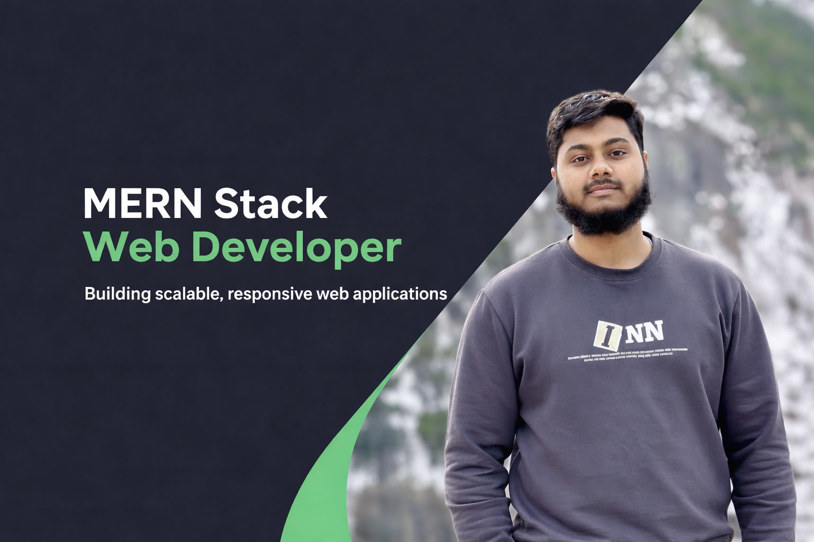

## Hi there 👋

I'm **Shahriar Ahmed Dipu**, a **Web Developer** from Canada 🇨🇦.  

☕ **Connect with me!**

  

❤️ I enjoy programming and building SaaS solutions to solve real-world problems.
💻 Most used line of code: `console.log("hello world")`  
🤝 Open to collaboration on MERN projects  
🤖 Curious about **Agentic AI** and its role in building intelligent,web applications.

---

## 🛠 Things I Code With

---
## 🤖 AI Automation With No-Code Tools

I’m actively exploring **AI-powered automation** and **agentic workflows** to build smarter, more efficient web solutions.

- 🔁 Workflow automation with **n8n** and **Make (Integromat)**
- 🎙️ Voice-driven automation using **Vapi** and **Retell AI**
- 💬 Building AI chatbots with **voice flows**, integrated with **Airtable**
- 🧠 Integrating AI agents with web applications for real-world automation

---

## 🚀 My Projects & Ventures

| Project | Description | Status |
|-------|------------|--------|
| Portfolio Website | Personal developer portfolio | 🚧 |
| MERN App | Full Stack MERN Application | ✅ |
| Dashboard | Admin dashboard with charts | 🚀 |

---
